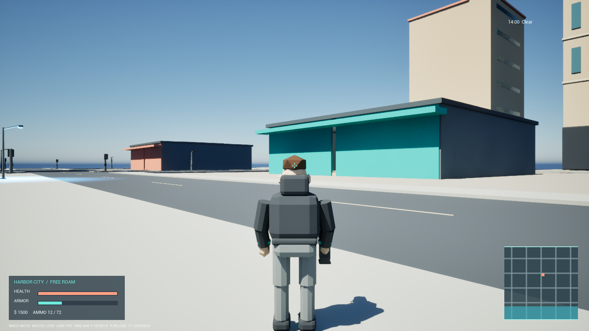

# Harbor City — Unreal Engine 5

Небольшая одиночная игра-песочница в открытом приморском городе. Можно исследовать карту, ездить на транспорте, пользоваться оружием, взаимодействовать с полицией и менять погоду/время через меню администратора.



Проект создан на C++ для **Unreal Engine 5.8.x**. Готовый `.exe` или `.app` в репозитории не хранится: при первом запуске Unreal соберёт игровой модуль на вашем компьютере. Ассеты карты уже включены.

## Быстрый запуск на Windows

Один раз подготовьте компьютер:

1. Установите **Epic Games Launcher**, а через него — **Unreal Engine 5.8**.
2. Установите **Visual Studio 2022 Community**. В Visual Studio Installer выберите workload **Game development with C++**. Проще всего импортировать приложенный файл `.vsconfig`.
3. На странице GitHub нажмите **Code → Download ZIP**, распакуйте архив в обычную папку без прав администратора.

Для игры дважды щёлкните `LaunchHarborCity.cmd`. Первый запуск может несколько минут собирать C++ и шейдеры. Не закрывайте окно, даже если оно временно выглядит неподвижным.

Если Unreal установлен в нестандартное место, создайте переменную окружения `UE_ENGINE_ROOT`, указывающую на папку `UE_5.8`, и снова запустите файл.

## Быстрый запуск на macOS

Один раз подготовьте компьютер:

1. Установите **Xcode** из App Store, запустите его и примите лицензию/доустановку компонентов.
2. Установите **Epic Games Launcher**, а через него — **Unreal Engine 5.8**.
3. Скачайте **Code → Download ZIP** и распакуйте архив.
4. Откройте Terminal в папке проекта и выполните:

   ```bash
   chmod +x LaunchHarborCity.command
   ./LaunchHarborCity.command
   ```

В дальнейшем файл `LaunchHarborCity.command` можно запускать двойным щелчком. Если macOS блокирует первый запуск, используйте правый щелчок → **Open**, либо разрешите запуск в **System Settings → Privacy & Security**. Первый запуск может несколько минут собирать C++ и Metal-шейдеры.

При нестандартной установке Unreal запустите так:

```bash
UE_ENGINE_ROOT="/путь/к/UE_5.8" ./LaunchHarborCity.command
```

## Если скрипт запуска не сработал

Откройте `Unreal_GTA_GPT6Sol.uproject` через Unreal Engine 5.8, согласитесь собрать отсутствующий модуль, дождитесь открытия карты `HarborCity` и нажмите **Play**. Подробности и команды для разработчиков находятся в [DEVELOPMENT.md](DEVELOPMENT.md).

## Управление

| Клавиши | Действие |
| --- | --- |
| `W A S D`, мышь | Движение и камера |
| `Shift`, `Space`, `Ctrl` | Бег, прыжок, приседание/ныряние |
| `F` | Сесть в транспорт или выйти |
| `E` | Взаимодействие |
| Левая/правая кнопка мыши | Атака/прицеливание |
| `R`, `Q`, колесо, `1–9` | Перезарядка и выбор оружия |
| `V` | Камера от первого/третьего лица |
| `H`, `L` | Гудок и фары в транспорте |
| `Tab` или `F1` | Меню администратора |
| `Esc` | Закрыть меню |

Подсказки также отображаются в HUD. Полная таблица функций есть в [FEATURE_MATRIX.md](FEATURE_MATRIX.md).

## Состав проекта

- `Content/GTA` — карта, материалы, звук и импортированные ассеты Unreal.
- `Source` — игровой C++-код.
- `SourceAssets` и `UnrealGTAGPT6Sol.blend` — исходники собственных 3D-моделей и звуков.
- `Automation` и `Tools` — воспроизводимая генерация/проверка контента.
- `GPT-6-Sol_UnrealEngine5_GTA_BlenderMCP_Prompt.md` — исходный промпт проекта.

Проект не связан с Rockstar Games или Take-Two Interactive и не содержит их игровых ассетов.
